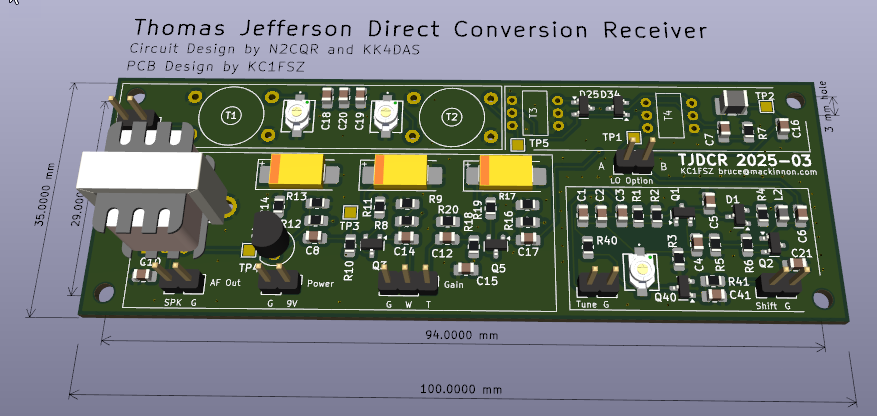

Overview
========

This is my compact PCB implementation of the famous Thomas Jefferson Direct Conversion Receiver
designed by Bill Meara (N2CQR) and Dean Souleles (KK4DAS). Full documentation for the 
original rig [can be found here](https://hackaday.io/project/190327-high-schoolers-build-a-radio-receiver). This project has been discussed at length
on the excellent Solder Smoke Podcast and in a detailed series of videos that can be found
[starting here](https://www.youtube.com/watch?v=rLjxU2rMeXw). I would particularly 
encourage you to watch Dean's superb tutorial series on YouTube. 

I built this rig as part of the "Direct Conversion Challenge" issued by Bill and Dean. As
stipulated by Bill/Dean, I am resisting all temptations to modify/improve the original 
circuit. However, technically speaking this is not a *pure* TJDCR since there 
are a few departures from the recommended construction techniques and part selections. 
Importantly, I am using modern construction techniques including a commercial PCB (single board), SMD 
components (mostly 0805), and the most compact layout I could come up with.

A huge thanks to Scott KQ4AOP for creating and sending me the tuning form 
needed to build the PTO!

Here's the KiCAD rendering of my board.  The part reference numbers are correct
in this picture:

Here's what the raw PCB it looks like in real life. The part reference numbers were
incorrect in this version of the board, but the KiCad model was later updated to 
fix this.

Here's the populated board:

And the full rig:

> [!IMPORTANT]  
> I know the purists may raise objections, so I would like to emphasize the value
> of building the TJDCR rig from Bill/Dean's exact specifications *first* before getting into 
> modifications including (but not limited to) PCBs and SMDs. The main point of the TJDCR
> project is to learn the process of building from scratch, and using a commercially
> fabricated PCB
> somewhat defeats that purpose. I've built DCR rigs a few times (as well as several SSB transceivers) using traditional Manhattan/Ugly (aka Beauty) 
> style so I'm trying to do something a bit different for fun. That being said, we are 
> moving into a new world where many components of value to radio homebrewers are not 
> available in through-hole packages. I would encourage everyone get over their
> fears of surface-mount parts, buy a decent headband magnifier, and start practicing 
> SMD-homebrew. I've found that by modifying the stock IPC-7351 0805 footprints provided in
> KiCad to 
> extend the pads outward 0.5mm or so you can use a normal soldering iron with a fine tip with 
> no problems.

Once the testing is complete I will make the PCB/BOM available for anyone who wants
to try building it in this style.

My [KiCAD schematic is here](https://github.com/brucemack/kc1fsz-tjdcr/blob/main/hw/tjdcr-1/plots/tjdcr-1.pdf) if you want to have a look. I've tried to use the official TJDCR part reference numbers
as much as possible.

Modification Notes
==================

This will probably get me into trouble, but I've deviated in a few places. I believe 
I've maintained the spirit of the original circuit. :grin:

* This is a single board design, whereas Bill/Dean recommend 4 boards to promote modularity.
You will note that I've silk-screened borders around the 4 modules on my board to 
emphasize the modularity of the original design. I have included test points on the 
PCB and I assemble/test the circuit in the recommended modules to simplify debug.
* I'm using ceramic non-polarized capacitors in some places where Bill/Dean used
polarized electrolytic caps.
* I'm not using the recommended silver/mica caps in my oscillator, primarily because
of size constraints. The first iteration of the build used NP0 caps and stability looked
pretty good. I strongly suspect that the compact "hardened" PCB eliminates some of the variability 
experienced in the Manhattan/Ugly construction so oscillator stability may be less of an 
issue. I'm doing some more experiments and will provide a write-up on my findings later.
* I am using T37-6 toroids where Bill/Dean used T50-6. This requires 
thinner wire and a great deal of winding patience. I think the board can physically handle the T50s 
if necessary. 
* I did not put in a trimmer for the top coupling capacitor in the band-pass filter. I'm 
comfortable with a cut-and-try approach on that component given how it impacts the shape
of the filter. Trimmers on the shunt caps are critical given the variability in the 
toroidal inductors.
* I am using Schottky diodes in the mixer since those were in the original TJDCR rig. I noticed
a later change to the 1N4148 switching diode, but I have not made that change yet.
* Note the "LO Option" connector on the board, which is not in the original 
schematic.  Normally the two pins on this connector
should be jumpered together, but those wanting to inject external VFOs may want to 
open this connection and attach the external frequency source to pin 1. This 
is also a good place to connect a frequency counter or to bridge the VFO to the 
companion transmitter module.
* There are a few extra parts (C40-C41, R40-R41) in the schematic to support a frequency offset 
feature that is described in SSDRA (page 218 figure 4). This is used to drive 
a companion CW transmitter module. Don't plug in C40 when you 
are building the stock TJDCR.

Tools
=====

I am using KiCAD V8 for the schematic capture and PCB layout.

Current Areas of Experimentation
================================

* The first iteration used a 4-layer PCB stackup since that provides the best
RF performance. As it turns out, there is very little routed on the bottom layer and 
the +9V routing is pretty simple. Plus, at 7 MHz a lot of this probably doesn't matter. I am 
going to create a 2-layer version of the layout to shave a 
few dollars and see if this makes any measurable difference. The 4-layer boards cost $1.40
each so we're not talking about a big difference here. 2-layer boards are also more easily
made by the fabs in the US. Unfortunately, I've not found an onshore fab that can do 4 layers as
quickly/cheaply as the offshore providers, which brings up a number of geopolitical issues. (Side
note: Thomas Jefferson was a strident global free-trade advocate.)
* The initial form-factor uses what I call a "half PCB": 100mm x 35mm.
That's half of the 100mm x 70mm size that cheap copper-clad PCB stock usually comes in.
I'm thinking of reworking the layout a bit to get into the more squarish 90mm x 50mm form-factor 
that is needed to fit into a Peppermint Altoids tin. Major QRP street cred possible here.
* I also like the super-small binocular BN43-2402 ferrite cores and will be testing
those on the mixer stage in the next iteration.
* I have a companion CW transmitter module I call "James Madison" which I will 
document later.

